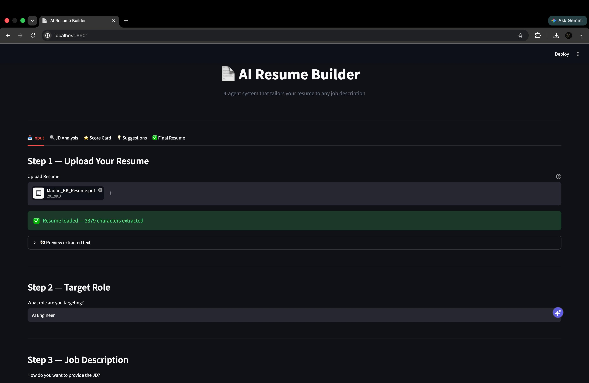
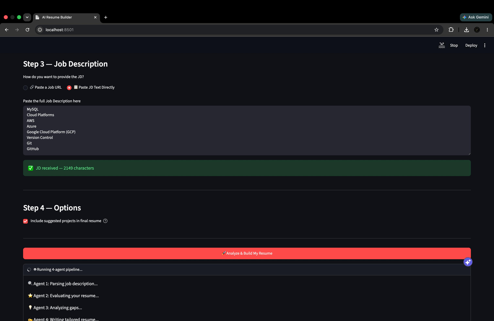
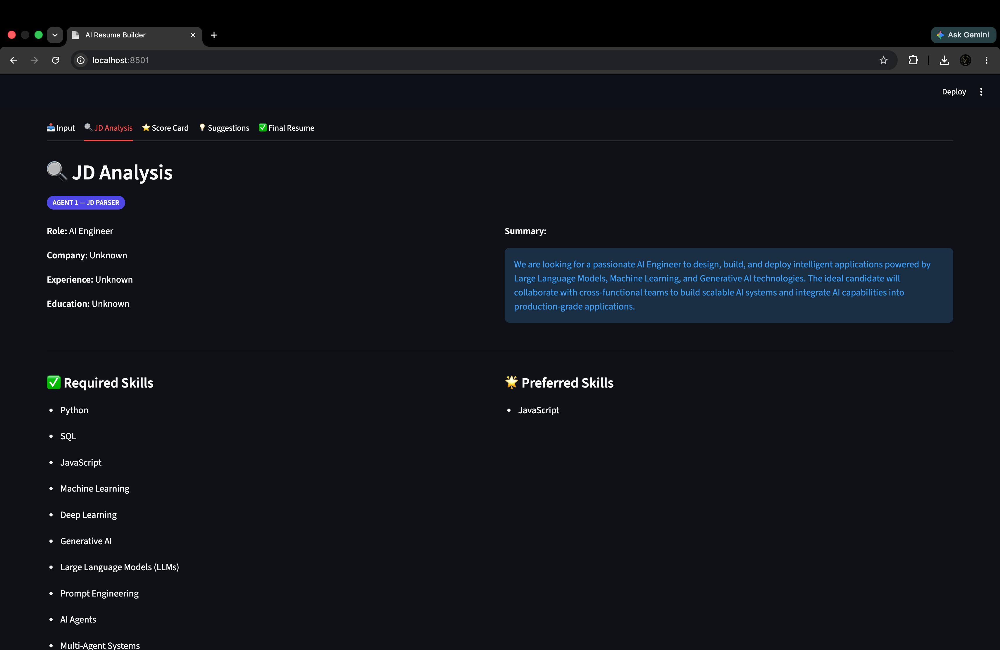
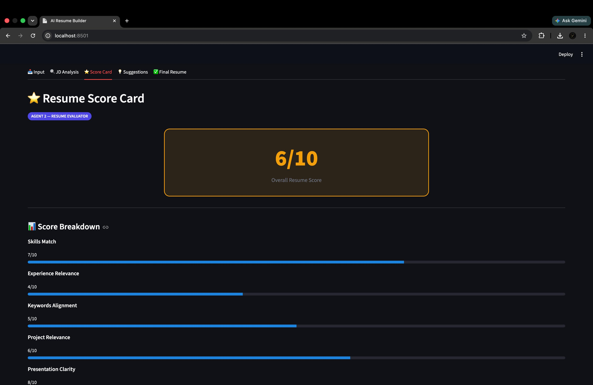
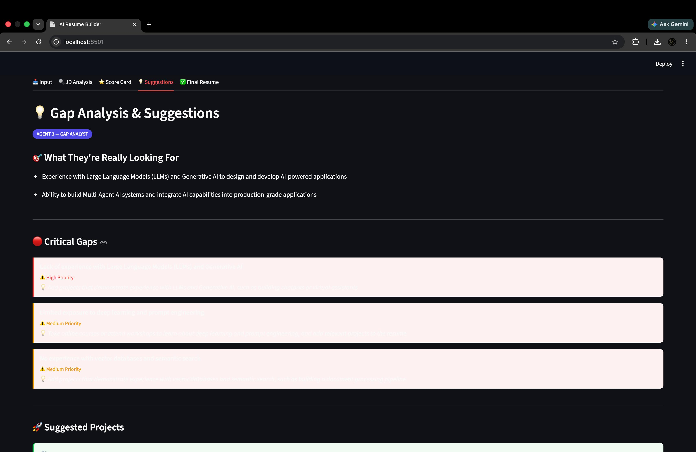
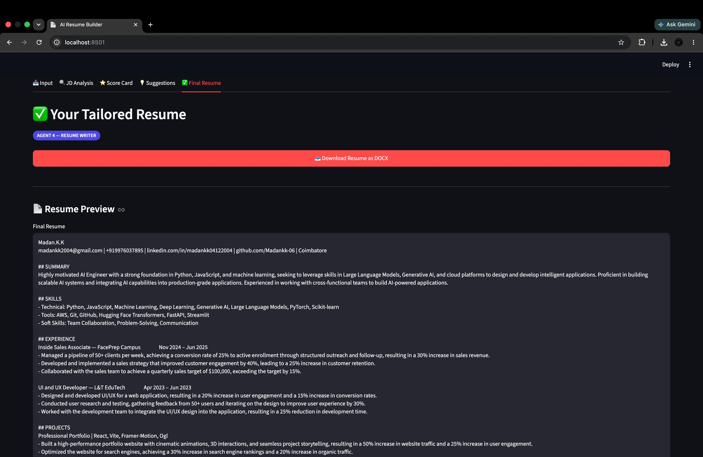
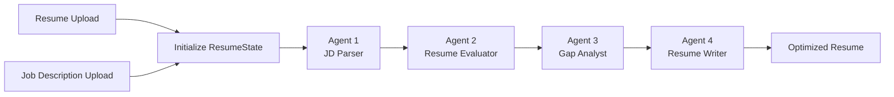
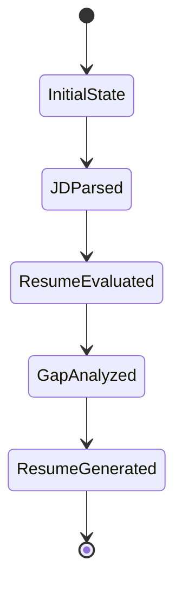

<div align="center">

# 🚀 Advanced Resume Builder
### 🤖 AI-Powered Multi-Agent Resume Optimization Platform

<p align="center">
Transform resumes into ATS-optimized, recruiter-ready resumes using a Multi-Agent AI workflow powered by LangGraph.
</p>

<!--  -->

---

<p align="center">


</p>

</div>

---

# 📖 Project Overview

**Advanced Resume Builder** is an intelligent **Multi-Agent AI Resume Optimization System** that automatically analyzes resumes against job descriptions and generates an ATS-friendly customized resume using a coordinated workflow of specialized AI agents.

Instead of relying on a single Large Language Model prompt, this application divides the resume optimization task into independent AI agents, each responsible for one specialized activity.

These agents are orchestrated using **LangGraph**, allowing the system to maintain shared state, coordinate execution, propagate outputs between agents, and recover gracefully from failures.

The result is a significantly more structured, explainable, modular, and scalable AI application compared to traditional prompt-based systems.

---

# 🎯 Motivation

Recruiters spend only a few seconds reviewing each resume.

Many qualified candidates are rejected because their resumes:

- Miss important ATS keywords
- Do not align with the Job Description
- Lack measurable achievements
- Have poor formatting
- Miss technical skills
- Do not highlight relevant projects

This project solves these challenges by creating an intelligent AI pipeline that:

✅ Understands the Job Description

✅ Evaluates the Resume

✅ Identifies Missing Skills

✅ Suggests Improvements

✅ Generates an ATS-Optimized Resume

---

# ✨ Key Features

## 🤖 Multi-Agent AI Architecture

Instead of one LLM doing everything, four specialized AI agents collaborate together.

---

## 📄 Job Description Parsing

Extracts:

- Required Skills
- Responsibilities
- Technologies
- Qualifications
- Keywords
- Experience Requirements
- Preferred Skills

---

## 📊 Resume Evaluation

Evaluates:

- Technical Skills
- Soft Skills
- ATS Compatibility
- Keyword Matching
- Project Relevance
- Resume Strength

---

## 💡 Skill Gap Analysis

Identifies:

- Missing Skills
- Missing Technologies
- Missing ATS Keywords
- Weak Resume Sections
- Improvement Opportunities

---

## ✍️ AI Resume Writer

Automatically rewrites the resume by:

- Improving wording
- Optimizing ATS score
- Keeping factual information
- Enhancing readability
- Adding suggested projects (optional)

---

## 🧠 LangGraph State Management

Every AI agent communicates through a shared state object.

Each agent enriches the state before passing it to the next stage.

---

## 🌐 Interactive Streamlit UI

Simple interface for:

- Resume Upload
- Job Description Upload
- Resume Analysis
- Resume Generation
- Download Final Resume

---
# 🖼️ Screenshots

## 🏠 Home Pages





---
## 💼 Job Description Upload



---

## 📊 Resume Evaluation


---

## 💡 Gap Analysis


---

## ✨ Final Generated Resume



---

# 🏗 High-Level Architecture

```text
                     Resume
                        │
                        │
                        ▼
             Resume Text Extraction
                        │
                        │
                        ▼
                Shared LangGraph State
                        │
        ┌───────────────┼────────────────┐
        │               │                │
        ▼               ▼                ▼

   Agent 1         Agent 2         Agent 3

 JD Parser → Resume Evaluator → Gap Analyst
                        │
                        ▼
                 Resume Writer
                        │
                        ▼
              ATS Optimized Resume
```

---

# 🔄 Complete AI Workflow

```text
User Uploads Resume
           │
           ▼
Upload Job Description
           │
           ▼
──────────── START ────────────

        Agent 1
      JD Parser
           │
           ▼
Extract Requirements
           │
           ▼

        Agent 2
 Resume Evaluator
           │
           ▼
Compare Resume
           │
           ▼

        Agent 3
   Gap Analyst
           │
           ▼
Find Missing Skills
           │
           ▼

        Agent 4
 Resume Writer
           │
           ▼
Generate ATS Resume

──────────── END ────────────
```

---

# ⚡ Why Multi-Agent AI?

Traditional AI systems ask a single LLM to solve everything in one prompt.

This project adopts a **Multi-Agent architecture**, where each agent specializes in one task.

### Benefits

- Better reasoning
- Modular design
- Easier debugging
- Explainable workflow
- Scalable architecture
- Reusable AI agents
- Improved output quality
- Fault isolation
- State-aware execution using LangGraph

---

# 🧠 Powered By

- LangGraph
- LangChain
- Google Gemini
- Groq
- Ollama
- Streamlit
- Python
- PDFPlumber
- python-docx

---

# 📂 Project Structure

The project follows a modular architecture where each component has a single responsibility.

```text
Advanced_resume_builder/
│
├── app.py                          # Streamlit application entry point
├── requirements.txt                # Project dependencies
├── llm_config.py                   # LLM configuration (Gemini / Groq / Ollama)
├── .env.example                    # Environment variables template
│
├── agents/
│   ├── jd_parser.py                # Agent 1 - Job Description Parser
│   ├── resume_evaluator.py         # Agent 2 - Resume Evaluation
│   ├── gap_analyst.py              # Agent 3 - Gap Analysis
│   ├── resume_writer.py            # Agent 4 - Resume Generation
│   └── __init__.py
│
├── graph/
│   ├── pipeline.py                 # LangGraph orchestration pipeline
│   └── __init__.py
│
├── prompts/
│   ├── jd_prompt.py
│   ├── evaluation_prompt.py
│   ├── gap_prompt.py
│   └── writer_prompt.py
│
├── utils/
│   ├── pdf_loader.py
│   ├── docx_loader.py
│   ├── parser.py
│   └── helpers.py
│
├── templates/
│   └── resume_template.docx
│
├── assets/
│   ├── banner.png
│   ├── home.png
│   ├── upload_resume.png
│   ├── upload_jd.png
│   ├── evaluation.png
│   ├── gap_analysis.png
│   └── final_resume.png
│
├── output/
│   ├── generated_resume.pdf
│   └── generated_resume.docx
│
├── README.md
└── LICENSE
```

---

# 🏛 Project Architecture

The application is divided into multiple independent layers to ensure scalability, maintainability, and modularity.

```text
                    Streamlit UI
                          │
                          ▼
                 User Uploads Files
                          │
                          ▼
                Resume Text Extraction
                          │
                          ▼
               LangGraph StateGraph
                          │
     ┌──────────┬──────────┬──────────┬──────────┐
     ▼          ▼          ▼          ▼

 JD Parser → Resume Evaluator → Gap Analyst → Resume Writer

                          │
                          ▼
                 ATS Optimized Resume
```

---

# ⚙️ Technology Stack

| Category | Technologies |
|-----------|--------------|
| Programming Language | Python 3.11+ |
| Frontend | Streamlit |
| AI Framework | LangChain |
| Agent Orchestration | LangGraph |
| LLM Providers | Google Gemini, Groq, Ollama |
| PDF Processing | PDFPlumber |
| DOCX Processing | python-docx |
| Prompt Engineering | LangChain Prompt Templates |
| Environment Management | python-dotenv |
| Dependency Management | pip |
| Version Control | Git & GitHub |

---

# 🧩 Core Libraries

This project leverages modern AI development libraries.

| Library | Purpose |
|----------|----------|
| LangGraph | Multi-Agent Workflow |
| LangChain | LLM Abstractions |
| Streamlit | Interactive Web UI |
| Google Gemini | Primary LLM |
| Groq | High-Speed Inference |
| Ollama | Local LLM Support |
| PDFPlumber | Resume Extraction |
| python-docx | DOCX Generation |
| dotenv | Secure Environment Variables |

---

# 🚀 Installation Guide

## 1️⃣ Clone the Repository

```bash
git clone https://github.com/Madankk-06/Advanced_resume_builder.git

cd Advanced_resume_builder
```

---

## 2️⃣ Create Virtual Environment

### Windows

```bash
python -m venv .venv

.venv\Scripts\activate
```

### macOS / Linux

```bash
python3 -m venv .venv

source .venv/bin/activate
```

---

## 3️⃣ Install Dependencies

```bash
pip install -r requirements.txt
```

---

## 4️⃣ Configure Environment Variables

Create a `.env` file in the project root.

```env
# Google Gemini
GEMINI_API_KEY=YOUR_GEMINI_API_KEY

# Groq
GROQ_API_KEY=YOUR_GROQ_API_KEY

# Anthropic (Optional)
ANTHROPIC_API_KEY=YOUR_ANTHROPIC_API_KEY

# Ollama (Optional)
OLLAMA_BASE_URL=http://localhost:11434
```

> **Important:** Never commit your `.env` file to GitHub. Ensure `.gitignore` contains `.env`.

---

# 🔑 LLM Configuration

The application supports multiple LLM providers, allowing flexibility based on availability and performance requirements.

| Provider | Purpose |
|----------|----------|
| Google Gemini | Primary reasoning and content generation |
| Groq | High-speed inference |
| Ollama | Local model execution (offline) |
| Anthropic | Optional enterprise integration |

The configuration layer automatically initializes the selected model using credentials stored in the `.env` file.

---

# ▶️ Running the Application

Once all dependencies are installed and API keys are configured, launch the Streamlit application:

```bash
streamlit run app.py
```

The application will be available at:

```text
http://localhost:8501
```

---

# 📄 Resume Processing Workflow

The application processes resumes through the following stages:

```text
Upload Resume
      │
      ▼
Extract Text
      │
      ▼
Clean & Normalize Content
      │
      ▼
Upload Job Description
      │
      ▼
Initialize LangGraph Pipeline
      │
      ▼
Run Multi-Agent Workflow
      │
      ▼
Generate ATS-Optimized Resume
      │
      ▼
Download Final Resume
```

---

# 📦 Dependency Installation Summary

```bash
pip install -r requirements.txt
```

Key packages include:

- langgraph
- langchain
- streamlit
- google-genai
- langchain-groq
- langchain-ollama
- pdfplumber
- python-docx
- python-dotenv
- reportlab
- firecrawl-py

---

# 💻 Supported Platforms

| Operating System | Supported |
|------------------|-----------|
| Windows | ✅ |
| macOS | ✅ |
| Linux | ✅ |

---

# 🔒 Security Best Practices

- Store API keys only in `.env`.
- Do not commit secrets to version control.
- Use virtual environments for dependency isolation.
- Regularly update dependencies to receive security fixes.
- Review generated resumes before sharing to ensure factual accuracy.

---

# 🧠 LangGraph Multi-Agent Architecture

Unlike traditional AI applications that rely on a single prompt, **Advanced Resume Builder** adopts a **Multi-Agent AI Architecture** powered by **LangGraph**.

Each AI agent is responsible for solving **one specialized problem**, making the system:

- Modular
- Explainable
- Maintainable
- Fault-Tolerant
- Easily Extendable

Rather than overwhelming a single LLM with multiple responsibilities, the workload is distributed among four intelligent agents coordinated through a shared state.

---

# 🏗 Why LangGraph?

LangGraph is a framework designed for **stateful AI workflows**.

Instead of executing isolated prompts, LangGraph allows AI agents to collaborate while sharing information through a common state object.

This provides several advantages over traditional sequential programming:

✅ Persistent shared memory

✅ Modular execution

✅ Easier debugging

✅ Better scalability

✅ Explicit workflow visualization

✅ Graceful error propagation

✅ Future support for branching and parallel execution

---

# 🔄 Complete LangGraph Workflow



---

# 📊 Pipeline Execution

The application compiles a **LangGraph StateGraph** where every AI agent becomes a node.

Execution Order

```
Start

↓

JD Parser

↓

Resume Evaluator

↓

Gap Analyst

↓

Resume Writer

↓

End
```

Each node receives the latest shared state, performs its specialized task, updates the state, and forwards execution to the next node.

---

# 📦 Shared ResumeState

Every agent communicates using a shared LangGraph state.

```python
ResumeState

├── resume_text
├── jd_text
├── parsed_jd
├── evaluation
├── gap_analysis
├── final_resume
├── current_step
└── error
```

The state evolves after each agent executes.

---

# 🔄 State Evolution

### Initial State

```text
resume_text

jd_text

parsed_jd = None

evaluation = None

gap_analysis = None

final_resume = None
```

---

### After Agent 1

```text
parsed_jd

✔ Required Skills

✔ Responsibilities

✔ Technologies

✔ Qualifications

✔ ATS Keywords
```

---

### After Agent 2

```text
evaluation

✔ Resume Score

✔ ATS Score

✔ Skill Match

✔ Missing Keywords

✔ Experience Evaluation
```

---

### After Agent 3

```text
gap_analysis

✔ Missing Skills

✔ Missing Technologies

✔ Resume Weaknesses

✔ Improvement Suggestions

✔ Suggested Projects
```

---

### After Agent 4

```text
final_resume

✔ ATS Optimized Resume

✔ Better Wording

✔ Better Formatting

✔ Improved Sections

✔ Download Ready
```

---

# 🤖 AI Agent 1

# Job Description Parser

## Purpose

The JD Parser acts as the foundation of the entire pipeline.

Its responsibility is to understand what the recruiter is actually looking for.

Instead of blindly comparing text, the parser extracts structured information from the Job Description.

---

## Input

```
Raw Job Description
```

---

## Output

```python
parsed_jd = {

required_skills,

responsibilities,

experience,

qualifications,

keywords,

technologies

}
```

---

## Responsibilities

- Extract required technical skills
- Detect preferred qualifications
- Identify ATS keywords
- Parse responsibilities
- Recognize technologies
- Normalize extracted information

---

## Why it matters

Every downstream AI agent depends on this structured output.

Without proper parsing, resume evaluation becomes unreliable.

---

# ⭐ AI Agent 2

# Resume Evaluator

The Resume Evaluator compares the uploaded resume with the parsed Job Description.

Instead of rewriting immediately, it first measures alignment.

---

## Input

```
Resume

+

Parsed JD
```

---

## Output

```python
evaluation = {

resume_score,

ats_score,

matched_skills,

missing_keywords,

strengths,

weaknesses

}
```

---

## Responsibilities

- Compare skills
- Compare experience
- Compare projects
- Measure ATS compatibility
- Evaluate keyword coverage
- Produce structured assessment

---

## Evaluation Criteria

✔ Skills Match

✔ Technical Stack

✔ Years of Experience

✔ Education

✔ ATS Keywords

✔ Project Relevance

✔ Resume Formatting

✔ Action Verbs

---

# 💡 AI Agent 3

# Gap Analyst

Once the resume has been evaluated, the Gap Analyst identifies everything missing.

This agent is responsible for producing actionable recommendations.

---

## Responsibilities

- Find missing technical skills
- Detect missing ATS keywords
- Identify weak resume sections
- Recommend improvements
- Suggest relevant projects
- Highlight missing technologies

---

## Output

```python
gap_analysis = {

missing_skills,

recommended_projects,

missing_keywords,

improvement_points

}
```

---

## Why this agent exists

Instead of immediately rewriting the resume, the system first understands exactly **what needs improvement**.

This significantly improves the quality of the final generated resume.

---

# ✍ AI Agent 4

# Resume Writer

The Resume Writer is the final AI agent in the pipeline.

It consumes outputs from all previous agents to generate an optimized resume.

Unlike a generic resume generator, it has complete contextual knowledge of:

- Original Resume
- Parsed Job Description
- Resume Evaluation
- Gap Analysis

This enables significantly higher quality generation.

---

## Inputs

```
Resume

Parsed JD

Evaluation

Gap Analysis
```

---

## Responsibilities

- Rewrite resume
- Improve ATS score
- Preserve factual information
- Enhance wording
- Improve readability
- Add suggested projects (optional)
- Maintain professional formatting

---

## Output

```
ATS Optimized Resume
```

---

# 🔄 Pipeline State Transition



---

# 🛡 Error Handling Strategy

Every agent executes inside a protected `try-except` block.

If an agent fails:

1. The error is captured.
2. The shared state is updated.
3. The pipeline records the failure.
4. Remaining agents are skipped.
5. A meaningful error is returned to the user.

This prevents incomplete or inconsistent outputs while simplifying debugging.

---

# 🎯 ATS Optimization Strategy

The system is specifically designed to improve Applicant Tracking System (ATS) compatibility by:

- Increasing keyword relevance
- Aligning skills with the Job Description
- Improving action verbs
- Enhancing measurable achievements
- Reorganizing resume sections
- Maintaining factual accuracy
- Preserving professional formatting

The objective is not just to rewrite the resume, but to maximize its relevance for automated screening systems.

---

# ⚡ Performance Characteristics

The application is designed to process resumes efficiently while maintaining modularity and scalability.

| Feature | Description |
|----------|-------------|
| Architecture | Multi-Agent AI |
| Workflow Engine | LangGraph |
| LLM Support | Gemini, Groq, Ollama |
| Resume Format | PDF / DOCX |
| Output Format | DOCX |
| State Management | LangGraph StateGraph |
| Frontend | Streamlit |
| Modular Agents | ✅ |
| Error Recovery | ✅ |
| ATS Optimization | ✅ |

---

# 📈 Scalability

The modular architecture makes it easy to extend the system.

Future AI agents can be integrated without modifying existing agents.

Examples include:

- Cover Letter Generator
- LinkedIn Optimizer
- Portfolio Analyzer
- GitHub Profile Evaluator
- Interview Question Generator
- Resume Translator
- Salary Prediction Agent

Adding a new capability simply involves:

1. Creating a new agent.
2. Registering it as a LangGraph node.
3. Connecting it within the workflow.

This makes the application highly scalable and maintainable.

---

# 🧪 Testing Strategy

The project was tested across multiple stages to ensure reliability.

## Unit Testing

Each AI agent can be tested independently:

- JD Parser
- Resume Evaluator
- Gap Analyst
- Resume Writer

---

## Integration Testing

The complete LangGraph workflow was validated by executing the full pipeline:

Resume → JD Parser → Resume Evaluator → Gap Analyst → Resume Writer

---

## UI Testing

The Streamlit interface was tested for:

- Resume Upload
- JD Upload
- Resume Evaluation
- Resume Generation
- Resume Download

---

## Error Handling Tests

The pipeline gracefully handles:

- Invalid Resume Files
- Empty Job Descriptions
- Missing API Keys
- LLM Request Failures
- Parsing Errors
- Unexpected Exceptions

---

# 🛡 Error Handling

Each AI agent executes within a protected execution block.

If an exception occurs:

```text
Exception

↓

Capture Error

↓

Update Shared State

↓

Skip Remaining Agents

↓

Return User-Friendly Message
```

Benefits include:

- Prevents corrupted outputs
- Easier debugging
- Reliable pipeline execution
- Improved user experience

---

# 🚀 Deployment

## Local Deployment

```bash
git clone https://github.com/Madankk-06/Advanced_resume_builder.git

cd Advanced_resume_builder

python -m venv .venv

source .venv/bin/activate

pip install -r requirements.txt

streamlit run app.py
```

---

## Docker Deployment (Future)

```bash
docker build -t advanced-resume-builder .

docker run -p 8501:8501 advanced-resume-builder
```

---

## Streamlit Cloud

Deploy directly using:

- GitHub Repository
- Streamlit Community Cloud
- Configure Environment Variables
- Deploy

---

## Future Cloud Deployment

The architecture is suitable for deployment on:

- AWS EC2
- Azure App Service
- Google Cloud Run
- Railway
- Render
- DigitalOcean
- Docker Containers
- Kubernetes

---

# 📊 Future Roadmap

## Phase 1 ✅

- Resume Parsing
- JD Parsing
- Resume Evaluation
- Gap Analysis
- Resume Generation
- Streamlit UI
- LangGraph Integration

---

## Phase 2 🚧

- Cover Letter Generation
- LinkedIn Optimization
- Resume Versioning
- Resume Templates
- Interview Question Generator

---

## Phase 3 🔮

- Voice Interview Preparation
- AI Career Coach
- Portfolio Review Agent
- GitHub Profile Analysis
- ATS Score Dashboard
- Resume Benchmarking
- Resume Analytics

---

# 🤝 Contributing

Contributions are welcome!

If you would like to improve this project:

1. Fork the repository

2. Create a feature branch

```bash
git checkout -b feature/new-feature
```

3. Commit your changes

```bash
git commit -m "Add new feature"
```

4. Push the branch

```bash
git push origin feature/new-feature
```

5. Open a Pull Request

---

# 📜 License

This project is released under the **MIT License**.

You are free to:

- Use
- Modify
- Distribute
- Learn from the code

Please retain the original copyright notice.

---

# 🙏 Acknowledgements

Special thanks to the amazing open-source community.

This project is built using:

- LangGraph
- LangChain
- Streamlit
- Google Gemini
- Groq
- Ollama
- PDFPlumber
- python-docx
- Python

Without these technologies, building a modular AI workflow would not have been possible.

---

# 👨‍💻 Author

## Madan KK

**AI Engineer • Full Stack Developer • Generative AI Enthusiast**

Passionate about building intelligent AI systems that solve real-world problems through Multi-Agent Architectures, LLM Orchestration, and Full-Stack AI Applications.

### Connect with me

- GitHub: https://github.com/Madankk-06
- LinkedIn: https://www.linkedin.com/in/madankk04122004/
- Email: madankk2004@gmail.com

---

# ⭐ Support the Project

If you found this project useful:

⭐ Star the repository

🍴 Fork the repository

🛠️ Contribute improvements

📢 Share it with others

Every contribution helps improve the project for the community.

---

<div align="center">

## 🚀 Built with ❤️ using LangGraph, LangChain, Streamlit & Generative AI

### "Transforming traditional resumes into intelligent, ATS-optimized career documents through Multi-Agent AI."

---

**⭐ If this project helped you, don't forget to star the repository! ⭐**

</div>
